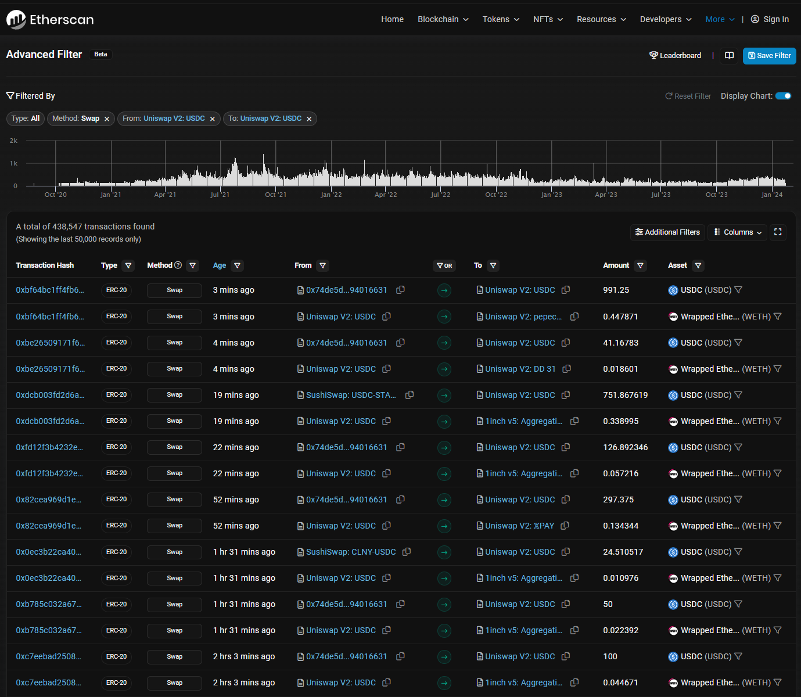
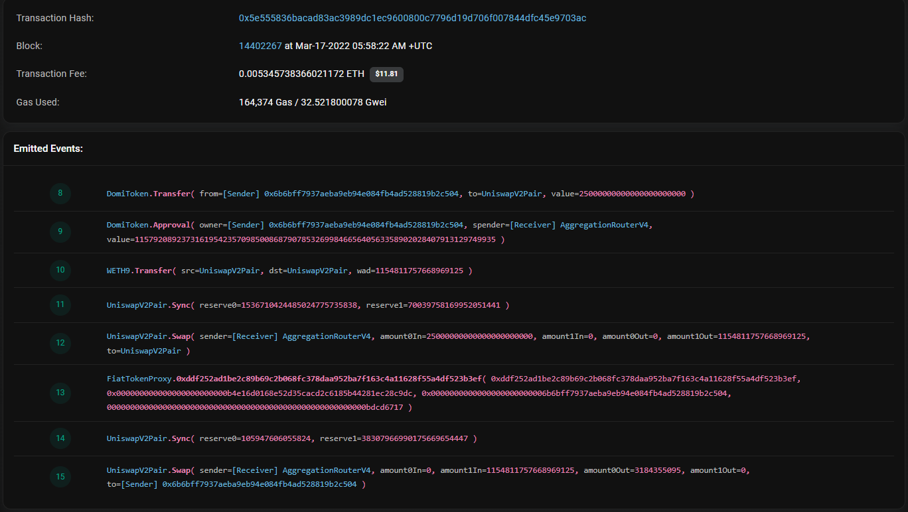
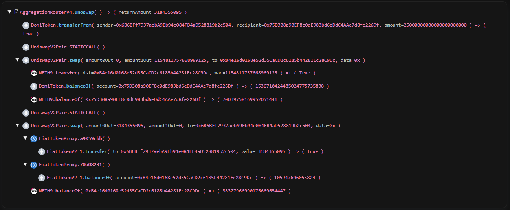

# CoinGecko Extension Questions

Contains the answers to CoinGecko's extension questions. Workings of the answers can be found in src/index

## Contract Calls Knowledge

1. Using web3.js to obtain the total supply of [MANA Token](https://polygonscan.com/token/0xa1c57f48f0deb89f569dfbe6e2b7f46d33606fd4) issued on the Polygon (MATIC) blockchain.

```TypeScript
const { Web3 } = require('web3');

const MANA_ADDRESS = '0xA1c57f48F0Deb89f569dFbE6E2B7f46D33606fD4';

const erc20Abi = [
  {
    name: 'totalSupply',
    outputs: [{ type: 'uint256' }],
    type: 'function',
  },
];

const web3 = new Web3(new Web3.providers.HttpProvider('https://polygon-rpc.com'));

const manaContract = new web3.eth.Contract(erc20Abi, MANA_ADDRESS);
const totalSupply = await manaContract.methods.totalSupply().call();

console.log('MANA Token Total Supply: ', web3.utils.fromWei(totalSupply, 'ether'));
// MANA Token Total Supply:  5147553.019447620157231392
```

## DEX Event Logs

1. Screenshot of list of recent swaps for [USDC/ETH pool on Uniswap V2](https://etherscan.io/address/0xb4e16d0168e52d35cacd2c6185b44281ec28c9dc).
   
2. Screenshot of how the raw number is being derived.
   
   
3. RPC API call to get all the swap events that were emitted for the block [#26444465](https://polygonscan.com/block/26444465)

- Get block logs by block hash

```TypeScript
const blockHash = '0x8f5210b3052133904b5596a1345dc361e832eed56b181226c459eecb51113336';

const data = {
  jsonrpc: '2.0',
  id: 1,
  method: 'eth_getLogs',
  params: [
    {
      blockHash,
      topics,
    },
  ],
};

const rpcApi = await fetch('https://polygon-rpc.com/', {
  method: 'POST',
  headers: {
    'Content-Type': 'application/json',
  },
  body: JSON.stringify(data),
});

const json = await rpcApi.json();

console.log(json.result);
console.log('Total swap events: ', json.result.length);
console.log(
  'Transaction Hash: ',
  json.result.map((tx: any) => tx.transactionHash)
);
// Total swap events:  1
// Transaction Hash:['0x3483fd0fa5d38905e28245ca9ca87b0ab331a104c509e3d239be8f1e5337c01b']
```

- Get block logs by block number

```TypeScript
// convert block number to hex
const block = web3.utils.toHex(26444465);

const data = {
  jsonrpc: '2.0',
  id: 1,
  method: 'eth_getLogs',
  params: [
    {
      fromBlock: block,
      toBlock: block,
      topics,
    },
  ],
};

const rpcApi = await fetch('https://polygon-rpc.com/', {
  method: 'POST',
  headers: {
    'Content-Type': 'application/json',
  },
  body: JSON.stringify(data),
});

const json = await rpcApi.json();

console.log(json.result);
console.log('Total swap events: ', json.result.length);
console.log(
  'Transaction Hash: ',
  json.result.map((tx: any) => tx.transactionHash)
);
// Total swap events:  1
// Transaction Hash:['0x3483fd0fa5d38905e28245ca9ca87b0ab331a104c509e3d239be8f1e5337c01b']
```

4. - Price impact:
     - The price change in the market that happens when a trader buys or sells an asset. In this case, a -42.09% of price impact on Quickswap means that the large trade significantly pushes the exchange rate against the you.
   - Why is price impact important:
     - High price impact translates to significant slippage, where you receive fewer tokens than expected due to price shifting during the trade. This can eat into your profits or magnify losses.<br />
       For example, with a -42.09% impact, receiving 100 USDC might cost you 170 USDC instead of the expected 160 USDC due to the price slippage.
   - Math behind price impact:

     - QuickSwap uses an automated market maker (AMM) model, specifically a constant product formula. This formula defines the relationship between the reserves (amounts) of two tokens in a liquidity pool and their price. Essentially, it states that the product of the reserves remains constant, even when there are trades.
     - Here is the simplified equation for price impact:

       > x \* y = k

       where:

       - x is the reserve of token A
       - y is the reserve of token B
       - k is a constant

       When you trade on Quickswap, you remove some of one token and add some of the other. This changes the reserves and consequently the price. The larger your trade, the greater the change in reserves and the higher the price impact.

   - Factors affecting price impact:
     - Liquidity: Deeper liquidity pools (more tokens in the pool) absorb large trades with less impact. Smaller pools are more susceptible to significant price swings.
     - Trade size: The larger the trade, the higher the price impact. This is because a larger trade removes a larger portion of one token from the pool, causing the price to adjust more significantly.
     - Volatility: More volatile tokens tend to have higher price impact due to their fluctuating market price.
   - Minimizing price impact:
     - Reduce trade size: Splitting your large trade into smaller ones can help reduce the impact on individual swaps.
     - Use time-weighted average price (TWAP) orders: These orders gradually execute your trade over a set time, minimizing price impact.
     - Choose liquidity pools with sufficient depth: Look for pools with larger reserves to handle your trade without significant price movement.
